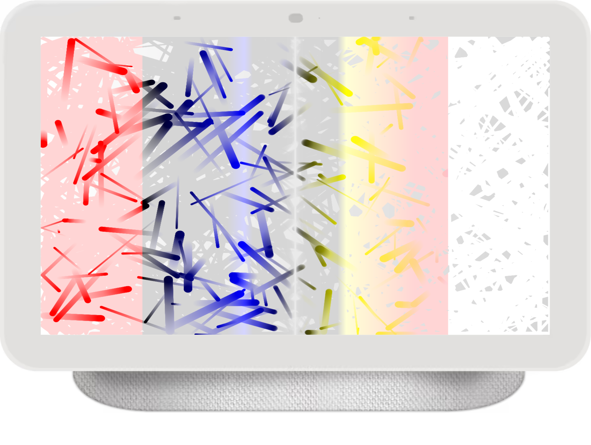

# HTML-Canvas-HSL-color-Createlineargradient

<h4>CreatedAt:27th Dec 2021</h4> 

## Detail of the project

This project is HTML Canvas beginners course in Youtube.

Vanilla JavaScript Project Tutorial for Beginners [ 2D Pipes ] HSL color & Createlineargradient: Franks laboratory

https://www.youtube.com/watch?v=zbVRgbvuEZ0

## Screen Shot

## Purpose of the project

Get the knowledge of HTML Canvas fundamentals

## Demo

https://hiros-dev.github.io/HTML-Canvas-HSL-color-Createlineargradient/

## What did I learn from this project?

HTML Canvas fundamentals

How to draw random circle with rondom HSL color

How to use class and constructor method 

## Impressions

I would like to create animation web pages and games in the future. 
So, I thought I should learn HTML canvas5 and I just tried it. 
I do not use HTML canvas effectively. 
But I will do in the future. So, I just practice and practice and practice as usual.

Anyway, thank you for reading. And, happy coding!!!
